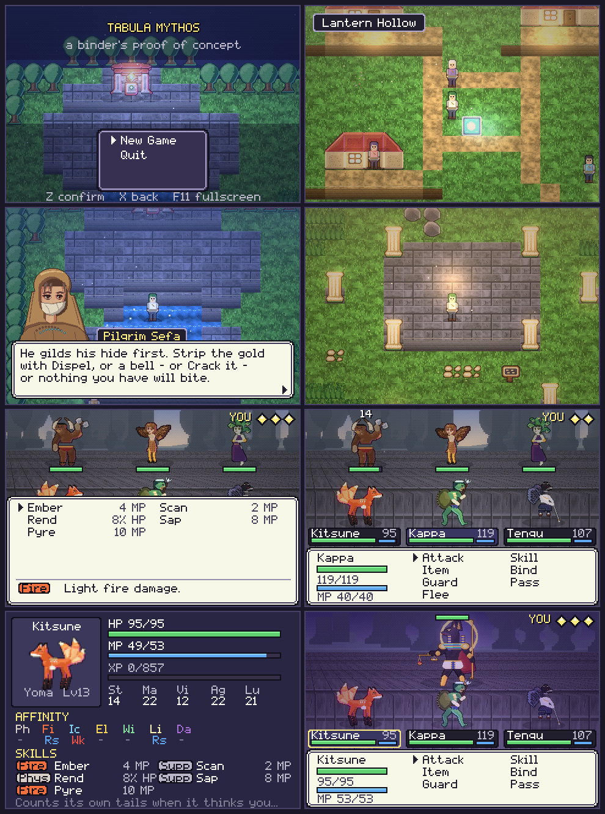
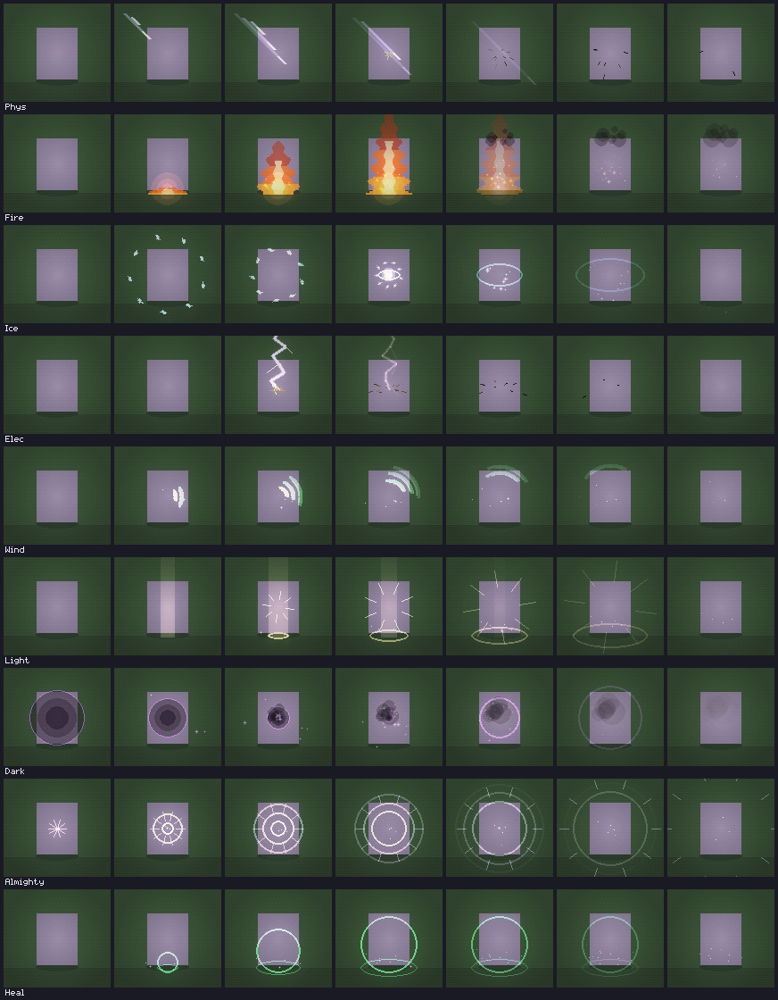
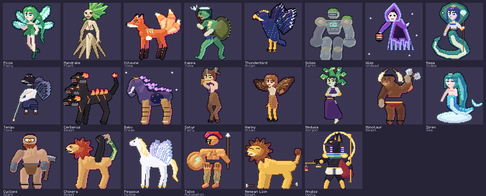
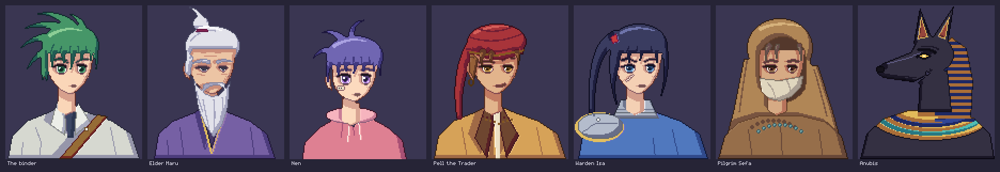

# Tabula Mythos

A proof-of-concept monster-binding RPG for Windows PC. Pixel sprites are lit
and staged in a diorama, and the finished frame is dithered down to 15-bit
colour the way a PlayStation framebuffer stored it. Twenty-two monsters from
world mythology, Greek and Roman included, drawn at 80×80 in an anime-leaning
style after Breath of Fire and Xenogears, each with its own attack
animation. Fire Emblem-style portraits for everyone who speaks. A
synthesised chiptune score, and a battle system built on Shin Megami
Tensei's **Press Turn** rules rather than Pokémon's.

You bind creatures instead of catching them, you field three at once, and a
single misread of an enemy's affinities can cost you the entire turn.



## Running it

**Windows, from source (easiest):**

```
run_windows.bat
```

That installs the one dependency and launches the game.

**Windows, as a standalone .exe:**

```
build_windows.bat
```

This installs PyInstaller, runs the tests, and writes `dist\TabulaMythos.exe`
— a single file you can copy anywhere and double-click. No Python needed on
the target machine. Saves go to `%APPDATA%\TabulaMythos\`.

**Any platform, manually:**

```
pip install -r requirements.txt
python main.py
```

Options: `--scale 1..4`, `--fullscreen`, `--mute`, `--flat` (turns off the
post-processing on very old hardware).

## Controls

| Key | Action |
| --- | --- |
| Arrows / WASD | Move, navigate menus |
| Z / Enter / Space | Confirm, talk, examine |
| X / Esc / Backspace | Back; opens the menu in the overworld |
| Shift (hold) | Run |
| S | Reorder monsters in the party screen |
| F11 / Alt+Enter | Fullscreen |
| `+` / `-` | Window size |
| F12 | Screenshot |

## The Press Turn system

Each side starts its turn with **one icon per living monster**. That is the
whole reason to bind more monsters: every ally is another action.

| What happened | Cost |
| --- | --- |
| Ordinary hit, heal, buff, item, guard | 1 full icon |
| **Hit a weakness, or land a critical** | ½ icon — a full icon starts blinking, and you act again |
| Pass | ½ icon |
| Miss, or hit something that **nulls** the element | **2 icons** |
| Hit something that **drains** or **repels** the element | **every remaining icon** |

Blinking half icons are always spent before full ones, so a weakness chain is
powerful but fragile. The enemy plays by exactly the same rules, and the AI
hunts your weaknesses deliberately — a party that shares a weakness will be
taken apart in a single turn.

Practical consequences:

- **Scan** before you experiment. Guessing at a Repel costs you the round.
- Physical arts cost HP, magic costs MP, and **Strike** is always free — you
  can never be locked out of acting.
- Buffs and debuffs act on damage directly: each stage is worth 25%, they
  stack three deep, and they wear off after three rounds. Against the boss
  they matter more than raw damage.

## Buffs, debuffs and the boss

A stage of attack multiplies damage dealt by 1.25, two stages by 1.5, three
by 1.75; a stage *down* divides by the same amount, so Sap on the attacker
and Ward on the defender stack against each other. Stages last three rounds
from the last time they were applied, and **Dispel** strips positive stages
only — it removes an enemy's buffs without clearing your own debuffs on it.

| Tool | Where | Effect |
| --- | --- | --- |
| Bolster / Ward / Haste | skills | allies' attack / defence / speed +1 |
| Sap / Crack / Slow | skills | foes' attack / defence / speed −1 |
| Dispel | Pixie (Lv11), Satyr (Lv10) | strips every foe's buffs |
| Ward Incense | shop, 90 | party defence +1 |
| Withering Salt | shop, 90 | every foe's attack −1 |
| Unbinding Bell | shop, 140 | Dispel, from the bag |

**Anubis** (`game/battle/bosses.py`) is scripted rather than greedy, and the
script is readable from the battle screen:

1. **Gilded Aegis** — his defence goes up two stages; a gold `D+2` tag
   appears by his gauge. Until you strip it with Dispel or a bell (or drag
   it back down with Crack), nothing you have hits hard.
2. **Verdict** — a physical sweep across the party.
3. **Lift the Scales** — he charges. `SCALES RAISED` flashes over him and
   you have exactly one turn before **the Weighing**, an Almighty blow to the
   whole party that no affinity resists. Ward, Sap, heal whoever is low — or
   eat it.
4. Below 30% HP he casts **Wrath of the Duat** (attack +2) and goes straight
   for the scales again. Sap it, or salt it.

He is immune to ailments, so Sleep and Bind are wasted turns. Losing to him
costs nothing: you wake at the shrine door, healed, with a hint. Pilgrim Sefa
at the shrine and Pell in the village both tell you what to bring.

## Spell effects



Each element is choreographed rather than being one shape scribbled over the
target: a wind-up, a strike, an aftermath. Fire gathers embers at the feet
before the column erupts and smoke curls off the top; ice shards converge from
outside, flash, and shatter outward; lightning forks down from off-screen;
dark collapses into a well of shadow and then bursts. Every effect also hands
the scene a screen-flash colour on the frame it lands.

Two rules do most of the work. Bright particles are drawn **additively** so
the bloom pass catches them and they bleed light. And anything that fades out
is drawn onto a scratch layer and *added* to the frame rather than blended —
fading a colour toward black and drawing it normally is how a dissipating
shockwave ends up as a hard black ring. Flame bodies are the exception and use
alpha, because added light over a green field turns yellow and then white,
which made the first version of the fire column read as a white pillar.

A worst-case cast — three targets, particles at peak — costs under 0.6ms.

## Binding monsters

Throw a sigil with the **Bind** command. The chance depends on how hurt the
target is (a monster at full HP is nearly impossible), its level relative to
yours, whether it is asleep/bound/poisoned/afraid, and the grade of sigil.
Bosses cannot be bound — the sigil shatters.

You carry six monsters; the **first three** fight, and you reorder them with
`S` on the party screen.

## The proof of concept in ~20 minutes

1. Lantern Hollow — talk to Elder Maru (he explains Press Turns), buy sigils
   from Pell, rest at Warden Isa.
2. Mistgrass Road — tall grass, wild monsters around Lv3–8. Bind two more so
   you have three icons.
3. The Marble Steps — a Greek ruin south-west of the road, Lv6–14, where the
   Hellenic half of the bestiary lives. A raised marble plaza, standing
   columns, and the lion.
4. Shrine of the Scale — deeper grass, Lv8–16 monsters, a healing spring.
5. The altar — **Anubis**, who repels Light, drains Dark, resists Physical,
   Fire and Ice, acts **twice per turn**, and is weak to exactly one thing:
   **Wind**. He meets you at your own level, from 14 to 17. Bring Dispel or
   a bell, bring incense and salt, and read the section above.

`tools/simulate.py` plays the same party and bag through the fight two ways:
a *tactician* that strips his gold, wards before the Weighing and saps his
wrath, and a *brute* that only ever attacks and heals.

| Level 14 party | Tactician | Brute |
| --- | --- | --- |
| Tengu, Pixie, Kappa | 87% | 3% |
| Thunderbird, Golem, Harpy | 100% | 28% |
| Kitsune, Kappa, Cerberus (all resisted) | 0% | 0% |

Playing him well is what wins; so is out-levelling him, slowly — a brute
party at level 19 wins 76% and at level 21, 94%. Cast Light at him once and
you will lose the entire round.

## The monsters

Twenty-two species, each with an affinity table meant to be exploited in both
directions. They are drawn at 80×80 (Anubis at 112) in three-quarter view,
in a style closer to Breath of Fire IV and Xenogears than to a cute
collectable: long limbs, sharp faces, slit eyes, and a detail of story in
each — the Nemean Lion stands among the arrows that bounced off it, the
Wisp is a lantern-carrying wraith under a cowl, and Talos's ankle is
leaking ichor round the nail.



**Japanese and general myth** — the road and the shrine:

| Monster | Race | Notable |
| --- | --- | --- |
| Pixie | Fairy | Weak to Physical and Dark; early healer |
| Mandrake | Plant | Weak to Fire; poisons and snares |
| Kitsune | Yoma | Fire and Scan; fragile |
| Kappa | Yoma | Resists Physical, Fire and Ice; weak to Electric |
| Thunderbird | Avian | **Nulls** Electric; weak to Wind |
| Golem | Earth | **Nulls** Dark, resists Physical/Fire/Ice; slow |
| Wisp | Undead | **Drains** Fire; weak to Ice and Light |
| Naga | Snake | **Drains** Ice; weak to Fire and Electric |
| Tengu | Yoma | **Nulls** Wind; fast, hits hard |
| Cerberus | Beast | Resists Physical, Fire, Dark |
| Baku | Dream | **Drains** Dark; weak to Light; sleeps your party |
| Anubis | Deity | The boss. **Repels** Light. |

**Greek and Roman** — the Marble Steps, and the deep grass beyond it:

| Monster | Race | Notable |
| --- | --- | --- |
| Satyr | Fairy | Lullaby and buffs; weak to Physical and Ice |
| Harpy | Avian | Very fast, very brittle; weak to Ice and Electric |
| Medusa | Gorgon | Dark and ailments; resists Physical; weak to Fire |
| Minotaur | Beast | Heavy Physical; resists Physical and Dark; weak to Electric |
| Siren | Sea | Ice and sleep; resists Ice and Dark; weak to Electric |
| Cyclops | Giant | Enormous damage, no speed. **Weak to Light** — aim for the eye |
| Chimera | Beast | Fire and poison; resists Fire and Dark; weak to Ice |
| Pegasus | Divine | Healer and haste; resists Wind/Light/Electric; weak to Dark |
| Talos | Automaton | **Nulls Fire**, resists Physical and Ice; weak to Electric |
| Nemean Lion | Beast | **Nulls Physical outright.** Its hide has never been cut |

The Nemean Lion is the roster's teaching moment: the free Strike is physical,
so a party carrying nothing but physical skills cannot scratch it. Bring
magic, or walk away — if you land nothing at all for eight rounds the fight is
called off rather than grinding on forever.

## Attack animations

Every species is authored in three poses — `idle`, `attack` and `cast` —
from the same parts (`game/art/parts.py`: tapered tubes, feathers, wings,
rotation about a pivot), so a Minotaur's axe is lifted and swung rather than
redrawn. `game/battle/perform.py` turns a skill into a performance:

- **Melee** (physical attacks): a wind-up, a dash toward the target with
  afterimages, the hit, and the return.
- **Cast** (magic): the caster rises into the cast pose with a glow, holds,
  and settles.
- **Support** (buffs, heals, the boss's charge): a shorter rise and hold.

The spell effect waits for the performance's impact frame, so the fire
column erupts when the Kitsune's tails flare, not before.
`python tools/anim_strip.py kitsune ember out.png` films one action in a
real battle scene, frame by frame.

## Portraits



Everyone who speaks has a bust in the Fire Emblem idiom: a three-quarter
face beside the text box, shoulders tucked behind it, sliding in as the
dialogue opens. Anubis speaks from the right, turned to face you, and the
pause menu shows the binder.

They come from their own renderer (`game/art/portraits.py`) because the
lighting they want is the opposite of the sprites'. Instead of normals and
banded Lambert shading, it is cel shading: a flat base, one shadow and one
light. Form shadows are crisp bands down the side away from the key light;
cast shadows fall under the fringe and the chin; the silhouette gets a dark
line and overlapping shapes get a softer one. Hair is built from tapered
locks that each end in a point. The eyes are stamped by hand, because in
anime faces they carry the character: lidded for the trader, narrowed for
the elder, sharp for the warden, round for Nen. Portraits are drawn at the
world's full 480×320 resolution through a `draw_front` hook, after the
colour grade but under the UI.

## Music

Eight tracks — title, village, road, ruins, shrine, battle, boss and victory —
synthesised at start-up by a small tracker in `game/music.py` from pulse,
triangle and noise voices. There are no audio files; the whole score is text
patterns in that one module, and rendering it takes under two seconds on a
background thread while the title screen comes up.

The writing borrows three specific habits from Toby Fox's soundtracks. One
seven-note motif (degrees 1 3 5 4 3 2 1 of the minor scale) runs through
nearly every track: warm and major in the village, a walking bassline on the
road, double-time in battle, slow and flattened for the boss. The melodies are
plain and singable over a small set of chords. And held notes get vibrato and
a little pitch drift, so a square wave sounds sung rather than beeped.

To hear a track without playing through to it, `python tools/render_music.py
out/` writes each one to a WAV.

## The renderer

The world is a lit diorama of pixel sprites, the Octopath Traveler approach,
finished the way a PlayStation frame was. It is not a 3D renderer: there are
no polygons and the camera does not rotate. What it takes from the PS1 is the
finish — the ordered dither and the 15-bit colour — and the sprite
proportions, which are taller and less chibi than a Game Boy's. In pygame:

**The diorama** (`game/render/diorama.py`). The ground plane is foreshortened,
tiles carry real elevation, and wherever terrain steps down a side face is
drawn — earth or stone, graded, with a lip of the surface hanging over the
edge and ambient occlusion pooling at the bottom. Trees, buildings, the shrine
gate and every character are **billboards**: upright sprites with contact
shadows, sorted back to front by the row they stand in. A building is just a
wall billboard with a roof billboard lifted onto it.

**The ground** (`game/art/terrain.py`). Terrain is generated at native screen
resolution — one source pixel per screen pixel — rather than 16×16 art
stretched to fill a tile, which used to leave the floor visibly chunkier than
anything standing on it. Each surface is built from seamless value noise
quantised into tone bands, then dressed: grass gets blades and clover, paths
get grit, flagstones get per-slab shading and cracks, water gets travelling
swells with a lit crest.

Two details matter more than the resolution. Every surface has **four
variants** that the renderer picks per tile from its coordinates, because one
tile repeated across a field reads as wallpaper however detailed it is. And
each variant's noise is **normalised to a fixed mean** — without that, tiles
drift lighter and darker than their neighbours and a meadow comes out looking
like a patchwork quilt.

Standing props — trees, columns, houses, the shrine — run through the same
shading pipeline as the monsters, so they are lit by the same model, and their
old top-down grass backgrounds are stripped so they stand on the ground rather
than in a square patch of their own.

**The stage** (`game/render/arena.py`). Each battle bakes its own floor once:
rows of the local terrain sampled at increasing depth toward a horizon, with
rolling hills and two layers of silhouetted scenery behind. It costs one blit
per frame thereafter.

**The sprites** (`game/art/monsters.py`, `game/art/shading.py`). Monsters are
not painted by hand. Each is a 64×64 *material* map — this pixel is fur, that
one is bronze, this one is an eye — and a lighting pass turns it into a
finished sprite.

The maps are not typed out as 64-character rows either; that was tried, and a
single miscounted dot bends a whole wing. Each creature is a set of parts
stamped onto a canvas back to front — wings, then body, then arms, then
head. Organic outlines come from `spans`, `ellipse` and `plume` (a curved,
swelling tail or feather); limbs, necks, tails and snakes are swept along a
path with `tube`; faces are written half-width and mirrored with `sym`; and
parts are placed by anchor with `pin`, so a leaf's base lands on the crown
wherever the leaf ends up. `tools/preview.py <name>` blows a sprite up to
inspect it.

The lighting pass:

1. **Distance fields** tell every pixel how deep it sits inside its own
   material and inside the silhouette. Two kinds of detail are deliberately
   *not* modelled as separate volumes. Markings — a muzzle, a belly, stripes —
   name the material they are painted on (`over=`) and are lit as part of it;
   otherwise the host bevels around them as if they were holes, and every
   muzzle grows a crease down one side. Flat features like eyes are ignored by
   the field for the same reason.
2. **Native resolution.** The art is drawn at the size it is shown, so there
   is no upscale and no procedural texture: detail is drawn, not generated.
   (The pipeline still accepts 32×32 art and doubles it with the EPX rule.)
3. **Quantised Lambert shading** from a key light at the upper left. Banding
   the result into five tones is what keeps it reading as pixel art instead of
   an airbrushed bevel.
4. **Hue-shifted ramps.** Shadows rotate toward blue and gain saturation;
   highlights rotate toward warm light and lose it. Flat value ramps are the
   single biggest thing separating amateur pixel art from this house style.
   Yellows are the exception: the short way from yellow to blue runs through
   green, so gold shaded that way looks mouldy. Their shadows go toward red.
5. **Rim light and coloured outlines** — a cool backlight on the edge facing
   away from the key, and outlines taken from a dark, hue-shifted version of
   whatever material they hug, never pure black.

Every material also has a personality: metal gets a hard specular step, cloth
stays matte, gems and flame are emissive and bleed into the bloom pass. Adding
a monster means drawing a silhouette, not painting four shades of everything,
and the whole roster stays lit by one consistent model.

**The finish** (`game/render/postfx.py`), passes over the frame in order:

| Pass | What it does |
| --- | --- |
| Point lights | Additive radial sprites — lantern windows, the shrine's hanging scale, spell impacts — drawn *before* bloom so they bleed |
| Fog | Distance haze toward the horizon |
| Bloom | Bright-pass, blurred twice, added back |
| Vignette, grade | Corner falloff, and a per-location tint: warm afternoon in the village, cold dusk at the shrine |
| PS1 framebuffer | A 4×4 ordered (Bayer) dither, then quantisation to 15-bit colour — five bits a channel, as the PlayStation stored its frame. The dither is what turns smooth gradients into that era's fine crosshatch |

The pass stack still supports tilt-shift depth of field, but every grade has
it switched off: a PS1 frame is sharp edge to edge, and the blur fought the
dither.

Every operation is a pygame blit, `smoothscale` or blend-flag fill, so it is
all C-speed. Measured on a CPU-only container with `tools/bench_frame.py`:

```
scene            ms/frame      fps
village +fx          4.52      221
route +fx            4.39      228
shrine +fx           4.66      214
battle +fx           3.55      282
(the same scenes with no post-processing run in about 1-2ms)
```

60fps needs 16.6ms, so the whole stack uses under a third of the budget.

**Resolution.** The world renders at 480×320, which is what gives bloom and
the dither enough pixels to read. The UI keeps its original 240×160 layout
space and is scaled up by exactly 2 on top of the finished frame, so text and
window frames stay sharp and are never blurred or bloomed.

## How it is built

Everything is Python and pygame-ce, and **every asset is source code** — the
sprites are material maps composed from parts, the font is a hand-authored 5×8
bitmap, the maps are character grids (with a second grid for elevation), and
the sound effects and all eight music tracks are synthesised at start-up. There are no binary assets
to lose, and the whole look can be retuned from `game/palette.py` and the
grade profiles in `game/render/postfx.py`.

```
main.py                 entry point
game/
  app.py                window, scaling, scene stack, transitions
  assets.py             builds every runtime surface once
  config.py             resolutions, tile size, diorama projection
  palette.py            the whole colour scheme
  font.py               5x8 bitmap font, proportional spacing
  pixelart.py           ASCII art -> pygame surfaces
  ui.py                 windows, gauges, press turn icons, menus
  sfx.py                procedural sound effects
  music.py              a small tracker and the score, synthesised at load
  monster.py            a monster instance: stats, growth, buffs, ailments
  player.py / save.py   party, bag, JSON save
  scenes.py             title, dialogue, party, bag, shop, bestiary
  art/
    shading.py          material maps -> lit sprites (fields, normals, ramps)
    parts.py            sprite authoring: tubes, feathers, wings, rotation
    monsters.py         22 species, three poses each, composed from parts
    portraits.py        cel-shaded dialogue portraits
    terrain.py          procedural ground, seamless, four variants each
    tiles.py            standing props, lit through shading.py
    actors.py           overworld characters
  render/
    diorama.py          extruded terrain, billboards, depth sorting
    arena.py            the baked battle stage
    postfx.py           lights, fog, bloom, grading, PS1 dither
    particles.py        ambient motes and impact sparks
  battle/effects.py     per-element spell choreography
  battle/
    engine.py           the Press Turn rules - no pygame, fully testable
    bosses.py           Anubis's script
    perform.py          attack and cast performances
    scene.py            battle presentation and input
    effects.py          damage numbers, element bursts, sigil throws
  data/                 elements, skills, species, items
  world/                maps.py, overworld.py
tests/                  39 tests: the turn economy, the engine, stages and
                        the boss, and that every speaker has a portrait
tools/                  headless playtest + balance simulation harnesses
```

## Checking a build

One command runs everything and leaves you screenshots to look at:

```
check.bat          # Windows
./check.sh         # macOS / Linux
```

It runs the engine tests, then three headless playthroughs that drive the real
game loop — a full run from the title screen, a walk from the village to the
boss, and a battle exercising skills, targeting and binding — and writes
screenshots to `check_output/`. About 25 seconds. A game can pass every test
and still look wrong, so the screenshots are the point: open them and look.

The same script runs on GitHub automatically on every push
(`.github/workflows/ci.yml`). A green tick next to a commit means it passed; a
red cross means it did not. Either way the run page has a **screenshots**
artifact you can download to see what that commit actually looked like.

## Development

```
python -m unittest discover -s tests   # 39 tests: press turns, engine, boss, portraits
python tools/simulate.py 300           # play 300 battles per matchup, print win rates
python tools/run_playtest.py out/      # drive the real game headlessly, save screenshots
python tools/run_world_test.py out/    # walk village -> route -> shrine, talk, shop, boss
python tools/contact_sheet.py out.png  # render every monster sprite
python tools/preview.py kitsune        # one sprite, blown up for inspection
python tools/render_music.py out/      # export every music track to WAV
python tools/make_roster_image.py      # regenerate docs/roster.png
python tools/make_portrait_image.py    # regenerate docs/portraits.png
python tools/anim_strip.py tengu gust out.png  # film one attack animation
python tools/effect_strip.py out.png   # filmstrip of every spell effect
python tools/shot_maps.py out/         # render each map in the diorama
python tools/bench_frame.py            # frame cost, with and without post-processing
```

The balance numbers in `tools/simulate.py` are what the difficulty was tuned
against: 95–100% wins at level against ordinary wild groups, about half
against a full group a level above you, near zero four levels under, and a
boss that a thoughtful party beats most of the time and a button-masher
almost never does. A badly matched starter against two monsters that hit
its weakness wins only about 7%, which is what Flee is for.

## Scope

This is a proof of concept, so it stops where the systems have been proven:
four maps, twenty-two species with attack animations, seven portraits,
forty-odd skills, one scripted boss, a bestiary, a shop,
saving, a complete Press Turn implementation, eight music tracks and a
diorama renderer with a PS1 finish. There is no fusion, no trading and no
multi-area story — those are the obvious next steps, not oversights.

The world is still 2.5D: sprites on a fixed-angle diorama. A Xenogears-style
world — real low-poly terrain and buildings the camera can orbit, with the
sprites standing in it — needs a 3D renderer, which pygame does not have. It
is the one part of the PS1 look this build does not attempt; the path there
is OpenGL through `moderngl`, drawing the same sprites as camera-facing
quads.

Terrain has no blending between surfaces yet — grass meets path on a hard tile
edge. Fringed transition variants would be the next visible upgrade there.
